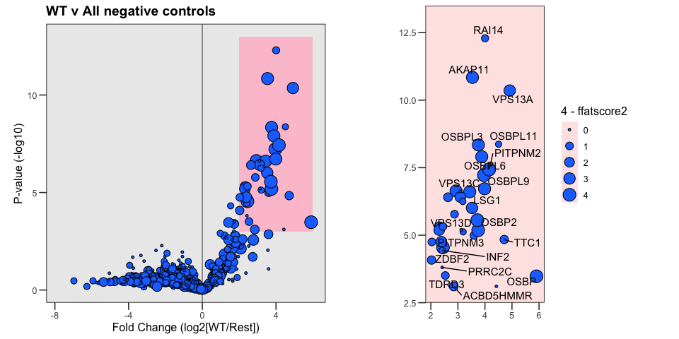
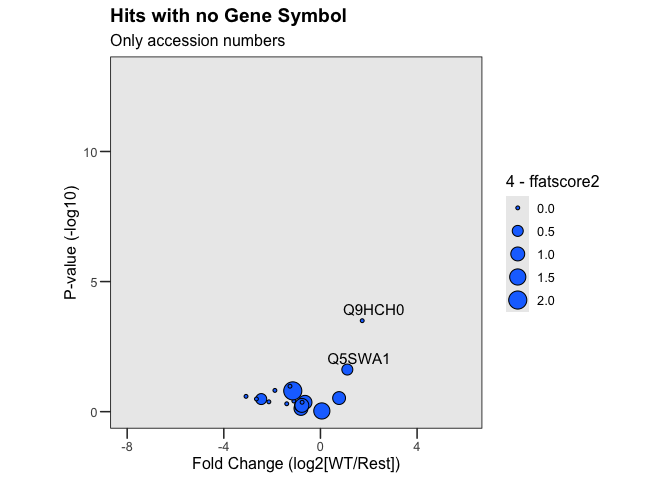
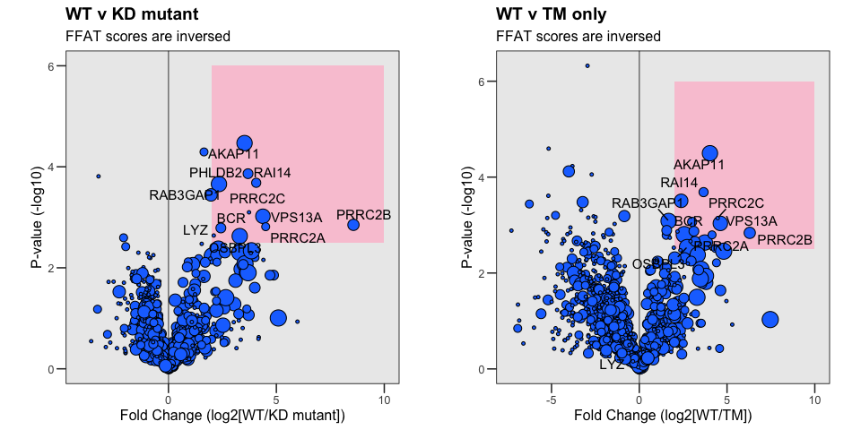

VAPB interactome
================
Birol Cabukusta
2026-07-28

# VAPB interactome

## 2026

Here we performed TurboID experiments with N-terminal TurboID-tagged
VAPB, its point mutant unable to interact with FFAT motifs \[K87D,
M89D\], TM helix only, soluble, free TurboID. Non-transfected cells were
also taken as controls. HeLa cells were treated overnight with oleic
acid to enhance lipid droplet surface area.

**Please cite** Published as Borst Pauwels et al. 2026  
<https://www.biorxiv.org/content/10.64898/2026.01.27.699657v1>

    ## 
    ## Attaching package: 'dplyr'

    ## The following objects are masked from 'package:stats':
    ## 
    ##     filter, lag

    ## The following objects are masked from 'package:base':
    ## 
    ##     intersect, setdiff, setequal, union

    ## 
    ## Attaching package: 'gridExtra'

    ## The following object is masked from 'package:dplyr':
    ## 
    ##     combine

## Wild-type v all other negative-controls unable to bind FFAT motifs

<!-- -->

Some of the genes don’t have any Gene Symbols, I don’t want to miss them
out just in case. <!-- -->

### Print all the hits above the thresholds

    ##    Gene.Symbol Accession  Rest_FC Rest_logP ffatscore
    ## 1      PITPNM3    Q9BZ71 2.447755  4.548722       0.0
    ## 2       FAM83G    A6ND36 3.593955  4.989876       3.0
    ## 3        ACBD5    Q5T8D3 2.847401  3.100533       2.5
    ## 4     RAB3GAP1    Q15042 2.931794  6.636978       0.5
    ## 5         INF2    Q27J81 2.415343  4.434459       3.5
    ## 6         LSG1    Q9H089 3.522274  6.008708       1.0
    ## 7      OSBPL11    Q9BXB4 4.505499  8.369061       3.5
    ## 8        WDR44    Q5JSH3 3.437895  6.607011       0.5
    ## 9      PITPNM1    O00562 3.749766  5.182417       0.0
    ## 10        TTC1    Q99614 4.714385  4.838794       2.7
    ## 11       RAI14    Q9P0K7 4.004640 12.290656       3.2
    ## 12        OSBP    P22059 5.904303  3.477732       0.0
    ## 13     OSBPL1A    Q9BXW6 3.092953  6.411751       1.5
    ## 14      OSBPL3    Q9H4L5 3.758737  8.341255       0.5
    ## 15        COPA    P53621 2.320237  5.308535       2.0
    ## 16         JMY    Q8N9B5 2.308862  5.189327       1.5
    ## 17       ZDBF2    Q9HCK1 2.026527  4.078785       2.7
    ## 18      OSBPL6    Q9BZF3 3.882646  7.904530       0.5
    ## 19        HMMR    O75330 4.423652  3.104978       6.0
    ## 20      VPS13A    Q96RL7 4.916303 10.357527       1.0
    ## 21         ECD    O95905 3.095269  6.620817       4.0
    ## 22       EEF2K    O00418 3.194123  5.120941       3.5
    ## 23      AKAP11    Q9UKA4 3.539033 10.842717       0.5
    ## 24      VPS13C    Q709C8 3.961249  7.221280       0.0
    ## 25      OSBPL9    Q96SU4 3.986724  6.717983       0.5
    ## 26       AFTPH    Q6ULP2 2.635336  6.405238       2.5
    ## 27      OSBPL2    Q9H1P3 2.389064  4.760145       1.5
    ## 28       CEP97    Q8IW35 2.038653  4.749812       3.0
    ## 29        HPS1    Q92902 3.120954  5.199806       4.0
    ## 30         BCR    P11274 2.445626  5.317965       3.0
    ## 31      PRRC2A    P48634 3.180762  6.246279       3.5
    ## 32     PITPNM2    Q9BZ72 4.155725  7.427851       0.0
    ## 33       TDRD3    Q9H7E2 2.534591  3.506691       3.0
    ## 34       OSBP2    Q969R2 3.719338  5.557543       0.0
    ## 35      PRRC2C    Q9Y520 2.419073  3.807266       4.0
    ## 36      VPS13D    Q5THJ4 2.874880  5.775755       3.0

## Wild-type v Two other negative controls

<!-- -->

## Check FFAT independent interaction partners

WIP

## GO ANALYSIS — WIP

Note that the `echo = FALSE` parameter was added to the code chunk to
prevent printing of the R code that generated the plot.
