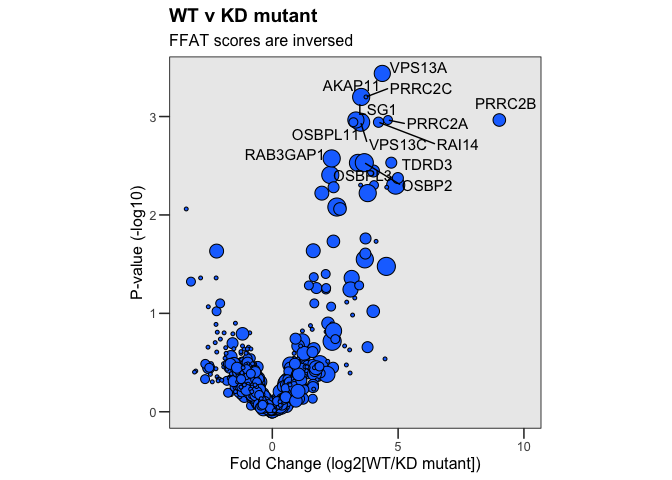
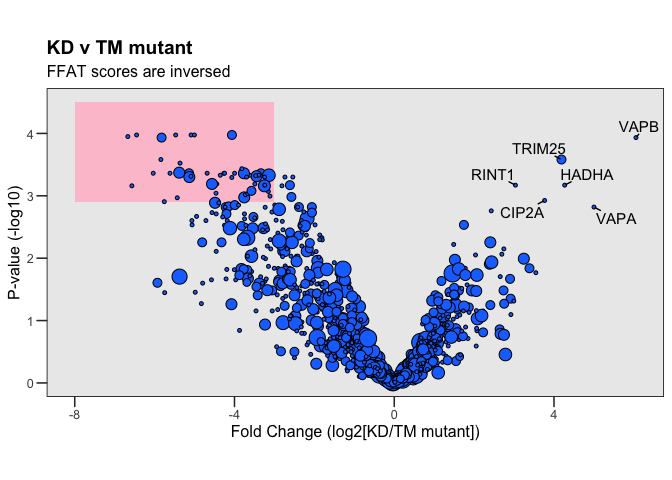
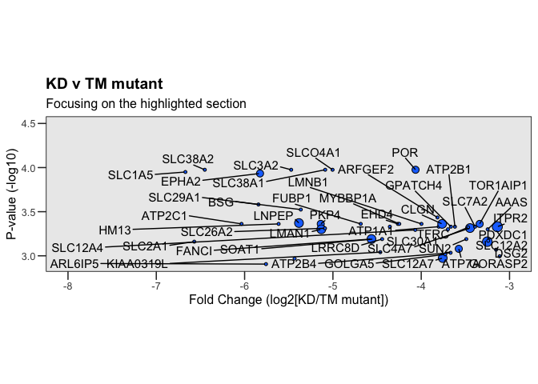
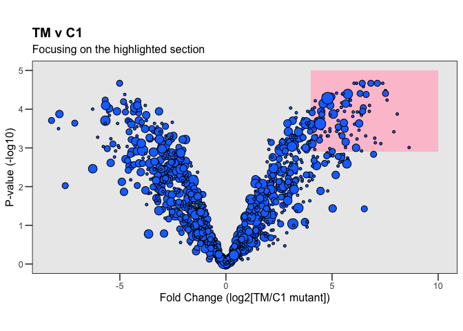
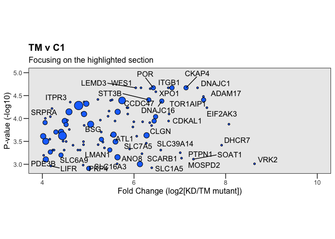

VAPB interactome
================
Birol Cabukusta
2026-07-28

## 2026

Here we performed TurboID experiments with N-terminal TurboID-tagged
VAPB, its point mutant unable to interact with FFAT motifs \[K87D,
M89D\], TM helix only, soluble, free TurboID. Non-transfected cells were
also taken as controls. HeLa cells were treated overnight with oleic
acid to enhance lipid droplet surface area.

**Please cite:** Published as Borst Pauwels et al. 2026  
<https://www.biorxiv.org/content/10.64898/2026.01.27.699657v1>

    ## 
    ## Attaching package: 'dplyr'

    ## The following objects are masked from 'package:stats':
    ## 
    ##     filter, lag

    ## The following objects are masked from 'package:base':
    ## 
    ##     intersect, setdiff, setequal, union

    ## 
    ## Attaching package: 'gridExtra'

    ## The following object is masked from 'package:dplyr':
    ## 
    ##     combine

## Wild-type v controls

Here we compared WT to all negative controls (KD/MD mutant, TM only,
TurboID only, and non-transfected cells).

<!-- -->

Some of the genes don’t have any Gene Symbols, I don’t want to miss them
out just in case.

<!-- -->

#### Print all the hits above the thresholds

    ##    Gene.Symbol Accession  Rest_FC Rest_logP ffatscore
    ## 1      PITPNM3    Q9BZ71 2.447755  4.548722       0.0
    ## 2       FAM83G    A6ND36 3.593955  4.989876       3.0
    ## 3        ACBD5    Q5T8D3 2.847401  3.100533       2.5
    ## 4     RAB3GAP1    Q15042 2.931794  6.636978       0.5
    ## 5         INF2    Q27J81 2.415343  4.434459       3.5
    ## 6         LSG1    Q9H089 3.522274  6.008708       1.0
    ## 7      OSBPL11    Q9BXB4 4.505499  8.369061       3.5
    ## 8        WDR44    Q5JSH3 3.437895  6.607011       0.5
    ## 9      PITPNM1    O00562 3.749766  5.182417       0.0
    ## 10        TTC1    Q99614 4.714385  4.838794       2.7
    ## 11       RAI14    Q9P0K7 4.004640 12.290656       3.2
    ## 12        OSBP    P22059 5.904303  3.477732       0.0
    ## 13     OSBPL1A    Q9BXW6 3.092953  6.411751       1.5
    ## 14      OSBPL3    Q9H4L5 3.758737  8.341255       0.5
    ## 15        COPA    P53621 2.320237  5.308535       2.0
    ## 16         JMY    Q8N9B5 2.308862  5.189327       1.5
    ## 17       ZDBF2    Q9HCK1 2.026527  4.078785       2.7
    ## 18      OSBPL6    Q9BZF3 3.882646  7.904530       0.5
    ## 19        HMMR    O75330 4.423652  3.104978       6.0
    ## 20      VPS13A    Q96RL7 4.916303 10.357527       1.0
    ## 21         ECD    O95905 3.095269  6.620817       4.0
    ## 22       EEF2K    O00418 3.194123  5.120941       3.5
    ## 23      AKAP11    Q9UKA4 3.539033 10.842717       0.5
    ## 24      VPS13C    Q709C8 3.961249  7.221280       0.0
    ## 25      OSBPL9    Q96SU4 3.986724  6.717983       0.5
    ## 26       AFTPH    Q6ULP2 2.635336  6.405238       2.5
    ## 27      OSBPL2    Q9H1P3 2.389064  4.760145       1.5
    ## 28       CEP97    Q8IW35 2.038653  4.749812       3.0
    ## 29        HPS1    Q92902 3.120954  5.199806       4.0
    ## 30         BCR    P11274 2.445626  5.317965       3.0
    ## 31      PRRC2A    P48634 3.180762  6.246279       3.5
    ## 32     PITPNM2    Q9BZ72 4.155725  7.427851       0.0
    ## 33       TDRD3    Q9H7E2 2.534591  3.506691       3.0
    ## 34       OSBP2    Q969R2 3.719338  5.557543       0.0
    ## 35      PRRC2C    Q9Y520 2.419073  3.807266       4.0
    ## 36      VPS13D    Q5THJ4 2.874880  5.775755       3.0

#### Wild-type v two key negative controls

<!-- -->

## Check FFAT independent interaction partners

I want to look at non-FFAT interactors: Interactions mediated by MSP
domain, but not FFAT motif, medieated by the transmembrane helix only.
For this, I used a code generated by ChatGPT. It does linear modeling
and adjusted p values.

#### Wild-type v KD

Let’s try it first with the wild-type protein

<!-- -->

#### KD v TM

<!-- --><!-- -->

#### TM v TurboID-only

List of TM enriched proteins are below.
<!-- --><!-- -->

    ##     Gene.Symbol    logFC    adj.P.Val ffatscore2
    ## 1      RAB3GAP2 3.524959 6.461647e-04        4.0
    ## 2          <NA> 8.071827 1.333237e-04        4.0
    ## 3      TOR1AIP2 5.217829 3.738040e-04        4.0
    ## 4         TBRG4 3.463593 4.900742e-04        4.0
    ## 5       TBC1D23 3.903608 2.134596e-04        4.0
    ## 6          UGT8 6.384338 1.428789e-04        4.0
    ## 7          HM13 4.775853 4.893092e-04        4.0
    ## 8        ANTXR1 3.437763 4.900742e-04        4.0
    ## 9         TAPT1 5.597008 3.211061e-04        3.2
    ## 10        TACC1 3.767123 2.290654e-04        1.0
    ## 11       ADAM17 7.515775 3.306109e-05        4.0
    ## 12        ANO10 6.472002 9.126048e-05        3.5
    ## 13       FNDC3A 2.942804 3.823673e-04        2.5
    ## 14        ITGB1 6.748570 2.135904e-05        4.0
    ## 15        USP33 4.489776 1.135688e-04        3.0
    ## 16        ITGA6 5.321835 3.280214e-04        4.0
    ## 17     SLC39A14 6.584780 4.900742e-04        4.0
    ## 18        DHCR7 7.912499 3.834551e-04        4.0
    ## 19         EHD4 5.455684 6.884534e-05        4.0
    ## 20        UBXN4 6.476738 2.606260e-05        4.0
    ## 21       ATP2C1 4.028886 6.378595e-04        4.0
    ## 22         VRK2 8.630575 9.770978e-04        4.0
    ## 23         VEZT 5.355028 4.390895e-04        4.0
    ## 24         NDC1 4.869120 7.625669e-05        4.0
    ## 25      TMEM214 5.864008 7.983712e-05        4.0
    ## 26        CLCC1 6.353307 2.235354e-05        4.0
    ## 27       MOSPD2 7.037554 7.357261e-04        4.0
    ## 28      SLC27A2 6.188525 1.180749e-04        4.0
    ## 29         RTN4 5.054395 1.333237e-04        2.5
    ## 30         KTN1 4.295695 1.975741e-04        3.5
    ## 31        ESYT1 4.911193 4.355047e-05        4.0
    ## 32      EIF2AK3 7.591322 5.816507e-05        4.0
    ## 33       OSBPL8 4.452946 3.133286e-04        4.0
    ## 34          LBR 4.824166 4.900742e-04        4.0
    ## 35      RETREG2 5.996500 1.180749e-04        4.0
    ## 36        CKAP4 7.135949 2.135904e-05        3.5
    ## 37        SRPRA 4.210517 6.062100e-05        4.0
    ## 38         ATL1 6.059898 2.437464e-04        4.0
    ## 39       CDKAL1 6.765136 7.983712e-05        4.0
    ## 40         TYW1 4.910302 7.983712e-05        3.0
    ## 41        ESYT2 2.136188 7.223391e-04        3.5
    ## 42       ITPRIP 5.976022 1.531455e-04        4.0
    ## 43       MBOAT7 6.755380 1.135688e-04        4.0
    ## 44       NUP155 5.644165 7.157544e-05        3.0
    ## 45      DNAJC16 6.606960 4.160987e-05        3.5
    ## 46      OSBPL10 3.890731 9.237887e-04        3.5
    ## 47        SYAP1 4.229105 4.893092e-04        4.0
    ## 48        ABCD3 3.433885 3.738040e-04        4.0
    ## 49     TOR1AIP1 7.519516 3.918433e-05        3.5
    ## 50        LEMD3 6.038092 2.135904e-05        4.0
    ## 51        ACSL3 5.848298 5.816507e-05        4.0
    ## 52       PKMYT1 5.472246 4.874290e-04        3.5
    ## 53       SREBF2 3.208510 6.142950e-04        1.5
    ## 54       PNPLA6 4.074067 3.154354e-04        2.5
    ## 55        SMPD4 5.434267 8.941650e-05        4.0
    ## 56      TMEM209 4.669533 3.841930e-04        4.0
    ## 57       SLC4A2 3.220062 8.567443e-04        2.5
    ## 58       NUP133 2.967368 6.868783e-04        3.5
    ## 59        RRBP1 4.409825 1.956243e-04        3.0
    ## 60        SCFD1 3.630569 1.759397e-04        4.0
    ## 61        STIM2 2.717220 9.770978e-04        3.0
    ## 62       ANKLE2 4.174989 9.126048e-05        4.0
    ## 63        SENP1 4.407282 6.308989e-04        3.5
    ## 64         CNST 4.520014 3.185993e-04        4.0
    ## 65       SREBF1 3.859600 9.922235e-04        3.5
    ## 66        LMAN1 5.640189 7.023547e-04        3.0
    ## 67         MTDH 3.597202 9.941521e-04        4.0
    ## 68      TMEM201 5.489309 4.038867e-05        4.0
    ## 69         ANO6 4.018445 2.437464e-04        3.0
    ## 70        IGF2R 3.142375 1.975741e-04        3.0
    ## 71        PTPN1 7.009221 5.601084e-04        4.0
    ## 72         TAP2 4.518533 1.361287e-04        3.5
    ## 73       DNAJC1 7.387290 2.135904e-05        4.0
    ## 74        STIM1 2.018869 6.308989e-04        4.0
    ## 75       SEC24A 3.864030 2.493428e-04        4.0
    ## 76       C2CD2L 3.073779 5.601084e-04        4.0
    ## 77      SLC26A2 5.504876 2.332630e-04        4.0
    ## 78         SCAP 6.344198 1.234088e-04        4.0
    ## 79        STT3B 6.323139 3.918433e-05        3.5
    ## 80        MACO1 4.897786 3.201873e-04        4.0
    ## 81        LPIN1 2.811501 6.421695e-04        4.0
    ## 82      ARFGAP3 3.474045 5.307727e-04        2.0
    ## 83         UFL1 3.962913 7.864750e-04        3.0
    ## 84       SEC24D 5.289155 2.862555e-04        3.5
    ## 85      ZC3HAV1 3.047883 9.315185e-05        4.0
    ## 86       SEC24B 3.122117 5.139935e-04        3.5
    ## 87       CCDC47 5.740087 4.038867e-05        2.0
    ## 88       MARCKS 2.657080 6.072339e-04        4.0
    ## 89         TMPO 3.966849 3.795774e-04        3.7
    ## 90         NBAS 2.899585 2.332630e-04        3.0
    ## 91       ATP1A1 4.163362 2.837310e-04        4.0
    ## 92          POR 6.421396 2.135904e-05        3.5
    ## 93         WFS1 6.152789 2.135904e-05        4.0
    ## 94         SUN2 5.266051 1.084398e-04        4.0
    ## 95       SLC4A7 4.959308 4.761249e-05        3.0
    ## 96        LMNB1 3.793104 2.290654e-04        4.0
    ## 97      SLC12A7 5.554021 2.253384e-04        3.0
    ## 98        PDE3B 4.074916 7.864750e-04        3.0
    ## 99       GOLGA5 4.255323 4.893092e-04        4.0
    ## 100       SCYL1 3.134839 4.893092e-04        4.0
    ## 101      ATP2A2 3.635971 5.407783e-04        3.5
    ## 102       CPT1A 4.587969 1.738600e-04        4.0
    ## 103      ATP2B1 4.548237 1.096084e-04        4.0
    ## 104       ITPR3 4.608870 4.390419e-05        4.0
    ## 105       ITPR1 2.652323 7.068290e-04        3.5
    ## 106     SLC16A3 5.632584 9.770978e-04        4.0
    ## 107        CLGN 6.274583 2.332630e-04        3.0
    ## 108       PRKD3 3.515244 2.388228e-04        4.0
    ## 109        XPO1 6.829177 2.135904e-05        3.5
    ## 110    FAM114A2 4.059805 1.230084e-04        3.5
    ## 111        SND1 2.839316 7.880842e-04        4.0
    ## 112     ARFGAP2 3.910751 2.290654e-04        4.0
    ## 113     SLC38A1 5.212392 3.843109e-05        4.0
    ## 114     SLC12A4 4.912833 1.414979e-04        4.0
    ## 115      SLC7A2 3.850847 1.135688e-04        4.0
    ## 116        LMNA 3.344333 3.019770e-04        4.0
    ## 117      SPECC1 3.306268 5.387264e-04        4.0
    ## 118       CAND1 3.931737 7.289679e-04        4.0
    ## 119       EPHA2 6.440289 1.134779e-04        3.5
    ## 120        GGCX 2.867003 5.804590e-04        4.0
    ## 121     SEC23IP 3.112555 9.237887e-04        2.0
    ## 122        IPO5 3.624910 3.211061e-04        4.0
    ## 123        ARAF 2.569763 7.920466e-04        4.0
    ## 124       LNPEP 3.750248 9.922235e-04        3.0
    ## 125       ITPR2 4.581214 7.157544e-05        2.5
    ## 126   KIAA0319L 5.903436 4.647580e-04        4.0
    ## 127      SCARB1 6.174155 5.885084e-04        4.0
    ## 128     SLC30A1 3.298830 1.653835e-04        4.0
    ## 129        <NA> 4.476336 4.900742e-04        4.0
    ## 130     GORASP2 4.064866 9.938465e-05        4.0
    ## 131        ANO8 6.129783 9.922235e-04        3.0
    ## 132      LRRC8D 3.113342 6.072339e-04        4.0
    ## 133     SLC12A2 3.417343 3.855353e-04        2.7
    ## 134         BSG 5.285524 1.975741e-04        4.0
    ## 135      SLC3A2 5.523151 3.918433e-05        4.0
    ## 136     ARL6IP5 4.494133 2.253384e-04        4.0
    ## 137      PDXDC1 3.316697 1.234088e-04        4.0
    ## 138       SOAT1 7.297223 7.742821e-04        4.0
    ## 139      SLC7A5 6.268902 3.468998e-04        4.0
    ## 140    RAB3GAP1 4.791938 5.209952e-05        0.5
    ## 141        INF2 4.174207 5.407783e-04        3.5
    ## 142        LSG1 4.438712 2.388228e-04        1.0
    ## 143        AAAS 5.586404 1.135688e-04        4.0
    ## 144    CDK5RAP3 4.898543 3.738040e-04        4.0
    ## 145     SLCO4A1 5.869016 5.816507e-05        4.0

## GO ANALYSIS — WIP

Note that the `echo = FALSE` parameter was added to the code chunk to
prevent printing of the R code that generated the plot.
